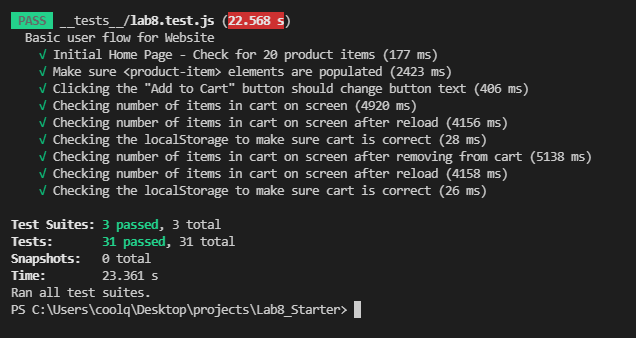

# Lab 8 - Starter

1. I would fit the automated tests within a Github action that runs whenever code is pushed because you can catch any problems before it gets merged with the main code. This ensures the main code has as little bugs as possible and can be fixed while minimal code was added.

2. No, because users don't directly interact with your functions.

3. You would not use a unit test to test the message feature. This is because messaging involves interactions with many parts of the application. You would only use a unit test to test a small part like one function.

4. You can use a unit test to test the max message length because you can input a test message into a max message length function and see if it returns true or false based on what you want.

